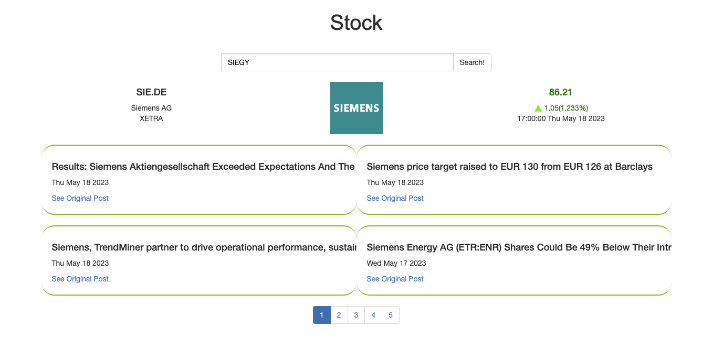
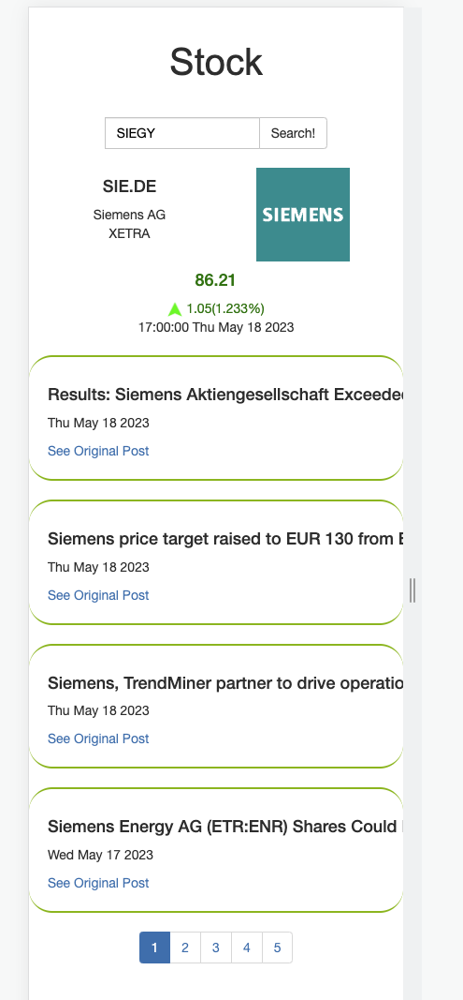
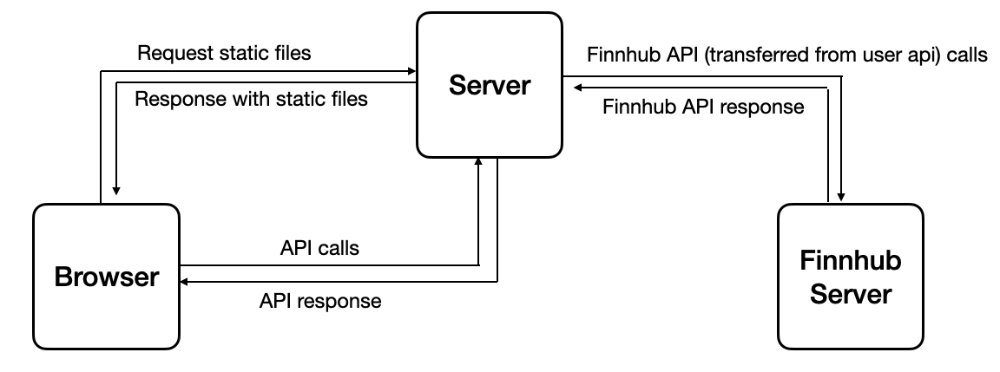

# Stock Search
## 1. Introduction
This is a simple web page for querying stock information. You can enter any stock code in the input box to query the corresponding information.

|            Desktop View             |              Mobile View               |
| :---------------------------------: | :------------------------------------: |
|  |  |

## 2. Model



## 3. Usage
- Install all the dependencies
```
npm install
```

- Run the server

```
node server.js
```

- Type your stock code in the input box and click the `Search` button (or simply press Enter)

## 4. Features

- The initial page load should render server-side. The first `index.html` is directly sent from server
- Pagination
- Jest

There is one test for the `transformNumber` function. Simply run:

```
npm test
```

- Progress bar
- Mobile-optimized version
